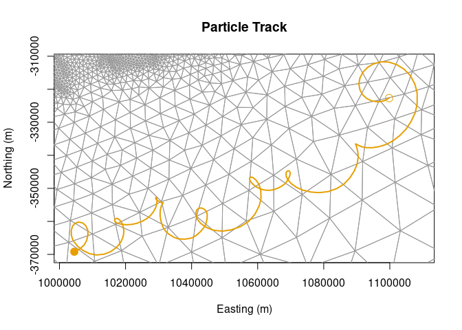

NECOFS Physics Model
================

Convenient access from R to
[FVCOM](http://fvcom.smast.umassd.edu/fvcom/)
[NECOFS](http://fvcom.smast.umassd.edu/necofs/) ocean physics model.

### Requirements

-   [R 4+](https://www.r-project.org/)
-   [ncdf4](https://cran.r-project.org/package=ncfd4)
-   [rlang](https://cran.r-project.org/package=rlang)
-   [dplyr](https://cran.r-project.org/package=dplyr)
-   [sf](https://cran.r-project.org/package=sf)
-   [R6](https://cran.r-project.org/package=R6)
-   [fvcom](https://github.com/BigelowLab/fvcom) **note this is not from
    CRAN**
-   [locate](https://github.com/BigelowLab/locate) **note this is not
    from CRAN**

### Installation

    devtools::install_github("BigelowLab/locate")
    devtools::install_github("BigelowLab/fvcom")
    devtools::install_github("BigelowLab/necofs")

## Data Access

``` r
library(necofs)
X <- NECOFSPhysics() # optional arguments, too.  See \code{?CascoBayPhysics}
X
```

    ## NE_Physics class: http://www.smast.umassd.edu:8080/thredds/dodsC/models/fvcom/NECOFS/Archive/NECOFS_GOM/2019/gom4_201901.nc 
    ##   CRS        : +init=nad83:1802 
    ##   t0         : -3506716800 
    ##   n timesteps: 744 
    ##   n elements : 99137 
    ##   n nodes    : 53087 
    ##   verbose    : FALSE

## Track a point

``` r
# We have already prepared an example track to save time
#p0 <- X$random_points(n = 1)
#pt <- particle_track(X, P0 = p0,  tstep = 60*20, tmax = (24*3600) * 7) 
pt <- example_track()
p0 <- pt |> dplyr::slice(1)
pt
```

    ## Simple feature collection with 505 features and 2 fields
    ## Geometry type: POINT
    ## Dimension:     XYZ
    ## Bounding box:  xmin: 1003562 ymin: -370164.3 xmax: 1108289 ymax: -311706.6
    ## z_range:       zmin: -0.9935118 zmax: 1.045226
    ## CRS:           +init=nad83:1802
    ## # A tibble: 505 × 3
    ##     elem time                                        geometry
    ##  * <int> <dttm>                                   <POINT [m]>
    ##  1  2878 2018-12-31 19:00:00 Z (1099790 -322677.3 -0.1266028)
    ##  2  2878 2018-12-31 19:20:00 Z (1099278 -322952.6 -0.1266028)
    ##  3  2878 2018-12-31 19:40:00   Z (1098765 -323228 -0.1266028)
    ##  4  2878 2018-12-31 20:00:00 Z (1098253 -323503.3 -0.1266028)
    ##  5  2878 2018-12-31 20:20:00 Z (1097670 -323611.8 -0.1734201)
    ##  6  2879 2018-12-31 20:40:00 Z (1097088 -323720.3 -0.2202374)
    ##  7  2880 2018-12-31 21:00:00 Z (1096454 -323826.7 -0.2649145)
    ##  8  2880 2018-12-31 21:20:00 Z (1095835 -323736.5 -0.2693629)
    ##  9  2880 2018-12-31 21:40:00 Z (1095216 -323646.2 -0.2738113)
    ## 10  3333 2018-12-31 22:00:00   Z (1094597 -323556 -0.2782596)
    ## # … with 495 more rows

``` r
plot_track(pt, X = X)
```

<!-- -->

``` r
plot_track(pt, X = X, ext = X$M)
```

<!-- -->
